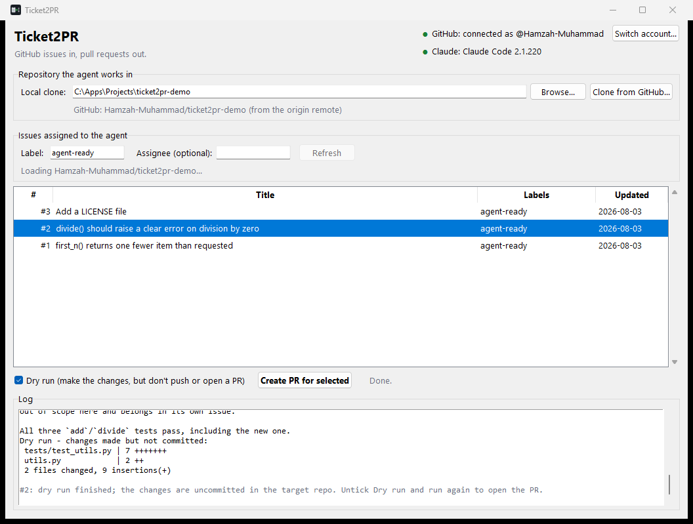
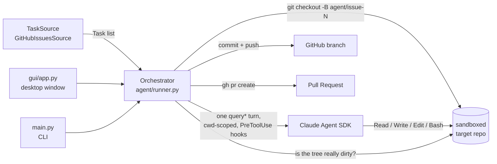

# Ticket2PR

[](https://github.com/Hamzah-Muhammad/Ticket2PR/actions/workflows/ci.yml) [](requirements.txt) [](https://docs.claude.com/en/api/agent-sdk/overview) [](LICENSE)

**Hand it a GitHub issue. Get back a pull request.**

Ticket2PR is an autonomous coding agent, built on Anthropic's [Claude Agent SDK](https://docs.claude.com/en/api/agent-sdk/overview), that picks up the issues you label for it, writes and tests the change in a real repository, and opens a pull request for a human to review. **It never merges anything itself.**

It ships as a desktop app, so the person handing work to the agent doesn't need a terminal, a config file, or an API key. Point it at a repository, tick an issue, click a button, and review the PR it opens.


*A real run against the [demo repository](https://github.com/Hamzah-Muhammad/ticket2pr-demo). The agent has read the codebase, run the existing tests to establish a baseline, and is writing the fix. Elapsed: 41 seconds.*

---

## See it work

| 1. Hand it a task | 2. Click it | 3. Review the result |
| --- | --- | --- |
| Open a GitHub issue and add the `agent-ready` label. Plain English, the way you'd brief a junior engineer. | The issue appears in the app's queue. Select it and press **Create PR for selected**. | A pull request appears on GitHub with the code change, a test covering it, and a written summary of what it did. |
| [Issue #2](https://github.com/Hamzah-Muhammad/ticket2pr-demo/issues/2) |  | [PR #12](https://github.com/Hamzah-Muhammad/ticket2pr-demo/pull/12) |

The pull request that run produced, opened by the agent and left for review:


It read the issue, branched as `agent/issue-2`, wrote the guard clause in `utils.py`, **added a test covering it**, and linked the issue so merging closes it. Three such PRs are open on the demo repo as a standing exhibit: [#10 (add a LICENSE)](https://github.com/Hamzah-Muhammad/ticket2pr-demo/pull/10), [#11 (off-by-one bug)](https://github.com/Hamzah-Muhammad/ticket2pr-demo/pull/11), [#12 (division by zero)](https://github.com/Hamzah-Muhammad/ticket2pr-demo/pull/12).

Worth noticing in that run: the demo repo has a *second*, unrelated failing test seeded in it. The agent spotted it, decided it was out of scope for the issue it was given, left it alone, and said so in its summary. Scope discipline is a prompt-and-harness design problem, not a model accident, and it is the difference between an agent you can leave running and one you can't.

---

## What one run actually does

```
An issue labelled agent-ready
        |
        v
1. git checkout main && git pull --ff-only && git checkout -B agent/issue-N
        |                                     (always a fresh branch off a fresh base)
        v
2. One Claude Agent SDK turn, working directory locked to your repo
     - it can Read / Write / Edit files, search them, and run Bash (tests, linters)
     - it cannot run git or gh at all: a hook denies those before they execute
        |
        v
3. Did the working tree actually change?  ---- no ---> stop, report, touch nothing
        |
       yes
        v
4. Refuse unless HEAD is still on agent/issue-N   ---- drifted ---> stop, commit nothing
        |
        v
5. commit -> push the branch -> gh pr create
        |
        v
   A pull request. A human reviews and merges it. The agent never does.
```

Steps 1, 3, 4 and 5 are plain deterministic Python. Only step 2 is the model. That split is the whole design: models are good at fuzzy judgment (what code to write), ordinary code is better at repeatable, auditable steps (the git lifecycle), and when something goes wrong you want the git part to be readable rather than inferred.

---

## Run it yourself

### The desktop app (no terminal needed)

Take [`Ticket2PR.exe`](Ticket2PR.exe) from the repo root (`git clone`, or *Code -> Download ZIP* on GitHub) and double-click it. One-time setup, three things:

| You need | How to get it | The app tells you if it's missing |
| --- | --- | --- |
| **GitHub CLI** | Install from [cli.github.com](https://cli.github.com/) | The status light turns red with an install link |
| **A GitHub connection** | Click **Connect**: the app shows a one-time code, copies it to your clipboard and opens GitHub in your browser. Approve, and you're in. A personal access token works too. | It opens the Connect dialog by itself on first launch |
| **Claude Code, signed in** | Install it natively: `irm https://claude.ai/install.ps1 \| iex`, then run `claude` once and log in | The status light turns red with the exact command |

No API key to paste anywhere and nothing stored by this app: GitHub access is the GitHub CLI's own login, and Claude access is your Claude Code login.

Then: **Browse** to a local clone (or **Clone from GitHub**, which lists your repositories), check the queue of `agent-ready` issues, select one, and click **Create PR for selected**. *Dry run* is ticked by default, so the first run makes the changes and shows you the diff without pushing anything. Untick it to open real pull requests.

Your last repository, label, assignee filter and dry-run setting are remembered in `%APPDATA%\Ticket2PR\settings.json`.

### The command line

```powershell
git clone https://github.com/Hamzah-Muhammad/Ticket2PR.git
cd Ticket2PR
python -m venv venv
venv\Scripts\python -m pip install -r requirements.txt

gh auth login                      # GitHub access
run.bat --dry-run                  # see what it would do
run.bat --discard-changes          # do it for real: every agent-ready issue becomes a PR
```

| Flag | Meaning |
| --- | --- |
| `--dry-run` | Make the code changes but stop before commit/push/PR |
| `--discard-changes` | Throw away uncommitted changes in the target repo first (what a dry run leaves behind) |
| `--target-repo` | Path to a local clone with `origin` on GitHub and push access (default: `config.py`) |
| `--issue N` | Only process issue `N` |
| `--label` | Which label counts as the queue (default: `agent-ready`) |
| `--repo-slug` | Override the `owner/repo` used for `gh` (defaults to the clone's `origin`) |

Defaults for the target repo, label and model live in `config.py`. Every prerequisite is checked at startup, and each failure prints the command that fixes it.

---

## How it's built

The agent's brain is one call into the Claude Agent SDK, in [`agent/runner.py`](agent/runner.py):

```python
options = ClaudeAgentOptions(
    system_prompt=SYSTEM_PROMPT,          # the job, the scope, the one hard rule
    cwd=str(repo_path),                   # the clone it works in
    allowed_tools=["Read", "Write", "Edit", "Glob", "Grep", "Bash"],
    hooks={"PreToolUse": [                # a veto over every tool call, before it runs
        HookMatcher(matcher="Bash",       hooks=[bash_guardrail_hook]),
        HookMatcher(matcher="Write|Edit", hooks=[make_path_jail_hook(repo_path)]),
    ]},
    max_turns=30,
)

async for message in query(prompt=f"Issue #{task.id}: {task.title}\n\n{task.body}", options=options):
    ...   # stream the agent's text to the log; its closing summary becomes the PR body
```

The SDK runs the agent loop (call the model, execute a tool, feed the result back, repeat) in a Claude Code subprocess, using your existing Claude Code login. What this project supplies is everything around it: which task to pick up, what the agent is allowed to touch, when a change is real enough to commit, and what happens to the result.

**The interesting engineering is that boundary, not the model call.** Four decisions define it:

| | In Ticket2PR | Where |
| --- | --- | --- |
| **Tools** | Six built-in tools and nothing else, narrowed further by two `PreToolUse` hooks: a Bash guardrail that denies every `git`/`gh` command plus `rm -rf`, `sudo` and pipe-to-shell, and a path jail that denies any write outside the repo or inside `.git/`. A denied call comes back to the model as a readable reason, so it can adapt instead of failing. | `agent/guardrails.py` |
| **System prompt** | One paragraph: smallest correct change, only relevant files, run the tests related to your change, leave pre-existing failures alone and report them, never touch git, finish with a summary fit for a PR description. The issue title and body are the user prompt, verbatim. | `agent/runner.py` |
| **Context** | One fresh turn per issue, so nothing bleeds between tasks. A 30-turn ceiling stops a stuck agent. Its output is streamed to the log as it happens and its closing summary is carried into the PR body, so the reasoning survives the end of the context window. | `agent/runner.py` |
| **State** | Deliberately none inside the model. State lives where humans can audit it: git (one `agent/issue-N` branch per issue, always rebuilt from a freshly pulled base) and GitHub (a label is the queue, a PR is the output). That makes runs idempotent: a dirty tree is refused up front, an already-open PR is updated rather than duplicated. | `agent/runner.py`, `main.py` |

The task source is pluggable: `tasks/base.py` defines a `TaskSource` protocol and `tasks/github_source.py` is the shipped implementation, so a Jira or Linear backlog would slot in without touching the orchestrator.

---

## The safety boundary

Giving a language model write access to a real codebase is the part that has to be got right. Three guarantees, each enforced by construction rather than by asking the model nicely:

**1. The agent cannot use git or GitHub.** Its entire tool surface is read, write, edit, search and shell, and a `PreToolUse` hook denies every `git` and `gh` invocation before it executes. Branching, committing, pushing and opening the PR are done by the harness.

**2. The agent cannot write outside the repository.** `cwd` on the SDK options is only the working directory the model reasons from; it does not restrict where a write can land. A second hook resolves every `Write`/`Edit` path and denies anything outside the clone, or inside `.git/`. This is not hypothetical, see the next section.

**3. Nothing ever lands on `main`.** The harness contains no merge code at all: no `git merge`, no `gh pr merge`. The branch name is built from GitHub's own integer issue number, so nothing in an issue's text can steer it. And two assertions in `agent/runner.py` refuse the run outright if the target is the default or a protected branch, or if `HEAD` is no longer on the task branch when it is time to commit.

Every result is a pull request. A human decides what merges.

---

## What the live runs caught

The interesting failures in agent tooling are rarely the model. They are the harness's assumptions about state. Each of these was found by running the thing for real, and each one is now a test:

1. **Stacked diffs.** The first live pass produced PRs containing each other's changes, because each branch was created from wherever `HEAD` happened to be after the previous task. Now every branch is rebuilt from a freshly pulled base.
2. **A commit pushed to the wrong ref.** Claude Code's own session checkpointing moved `HEAD` mid-turn; pushing by local branch name silently stranded the commit instead of erroring. Now it pushes `HEAD:<branch>` explicitly.
3. **A write outside the repository.** Re-running the LICENSE issue reproduced exactly what the path jail exists for: the agent's first attempt wrote the file to the repo's *parent* directory. The hook denied it, the agent read the denial and corrected itself in the same turn, and the file landed in the right place.
4. **Work committed onto local `main`.** Following on from #2: if `HEAD` drifted back to `main`, `git add -A && git commit` put the agent's commit on `main` before the push ever happened. Reproduced against real git with the new assertion disabled, main's tip became `Closes #7: Fix`. Now the run refuses and leaves the changes in the working tree.
5. **A documented workflow that could not run twice.** A dry run leaves changes uncommitted, so the next run's `git checkout main` inherited them. Now a dirty tree is refused at startup, with a one-click reset in the app and `--discard-changes` on the CLI.

---

## Known limitations

Being straight about what this does *not* protect against:

- **The Bash guardrail is a text blocklist, not a sandbox.** It pattern-matches for `git`, `gh` and a few dangerous shapes. A command that reaches equivalent behaviour without those literal words (a Python git library, say) would not be caught. The SDK does offer real OS-level sandboxing, but it is macOS/Linux only and this was built for Windows.
- **Issue bodies are untrusted text fed straight into a prompt**, and outbound network access is not restricted. On a repository where the public can file issues, that is a real prompt-injection surface. Point it at repositories whose issues you trust.
- **Both hooks fail closed, but they are two specific hooks, not a proof of containment.** Treat them as raising the bar.
- **Small, well-specified issues are its sweet spot.** A vague issue produces a vague PR, or none at all, which is why every result stops at review.
- **Windows first.** The library code is cross-platform and CI runs on Ubuntu too, but the packaged app and the `run.bat` entry point are Windows.

---

## Troubleshooting

Every message below is printed by Ticket2PR itself.

| Message | Fix |
| --- | --- |
| `GitHub CLI (gh) is not installed or not on PATH` | Install from [cli.github.com](https://cli.github.com/), reopen the terminal |
| `GitHub CLI is installed but not logged in` | `gh auth login`, or click **Connect** in the app |
| `Claude Code is installed via npm (claude.cmd), which the Agent SDK refuses` | Install natively: `irm https://claude.ai/install.ps1 \| iex` (cmd.exe shims can be argument-injected, so the SDK declines them) |
| `... is not a git repo` | Point `--target-repo` (or **Browse**) at a real clone |
| `... has uncommitted changes` | `--discard-changes`, or accept the reset the app offers |
| `Refusing to commit: HEAD is on 'main'` | Something moved `HEAD` during the turn. Nothing was committed; the changes are still in the working tree |
| `No changes produced - skipping commit/PR` | The agent judged nothing needed doing. Make the issue more specific |
| `PR already open for agent/issue-N` | Expected on a re-run; the existing PR was updated by the push |

---

## Architecture



## Project layout

```
config.py                  Edit this: default target repo, label, model
main.py                    CLI entrypoint: startup checks, per-task failure isolation
run.bat                    Double-click to run the CLI with config.py defaults
ticket2pr_gui.py           Desktop entrypoint (what Ticket2PR.exe runs), plus
                           headless --smoke / --run-issue modes for verifying a build
gui/engine.py              Everything the window does minus the widgets: GitHub login
                           flows, repo listing/cloning, Claude CLI lookup, settings
gui/app.py                 The tkinter window, Connect and Clone dialogs
agent/runner.py            Per-task orchestration: branch -> agent turn -> commit/push/PR,
                           and the assertions that keep it off main
agent/guardrails.py        Bash blocklist + Write/Edit path jail, both as PreToolUse hooks
tasks/base.py              Task dataclass + TaskSource protocol
tasks/github_source.py     GitHubIssuesSource, backed by the gh CLI
tests/                     67 tests: guardrails, path jail, task parsing, the run_task
                           harness, push safety against real git, startup checks, the
                           desktop engine
Ticket2PR.spec, .ico       PyInstaller build; Ticket2PR.exe is the prebuilt binary
```

## Testing

```powershell
venv\Scripts\python -m pip install -r requirements-dev.txt
venv\Scripts\python -m pytest        # 67 tests
venv\Scripts\python -m ruff check .
venv\Scripts\python -m black --check .
```

All three run on every push via [GitHub Actions](.github/workflows/ci.yml), on Windows and Ubuntu, Python 3.11 and 3.13. The git and push-safety tests drive real local repositories with a real bare `origin` rather than mocks, so the guarantees above are checked against git's actual behaviour, with no network and no model in the loop.

## Rebuilding the app

```powershell
venv\Scripts\python -m pip install -r requirements-dev.txt
venv\Scripts\python -m PyInstaller Ticket2PR.spec --noconfirm
```

Onefile build at `dist/Ticket2PR.exe`, with the icon and version resource embedded. It is a console executable that hides its own console once the window opens: the SDK, git and gh all run as child processes, and children of a hidden console stay hidden, where a windowed build would flash a console for each. The root-level `Ticket2PR.exe` is rebuilt and re-committed whenever app code changes.

## License

MIT
