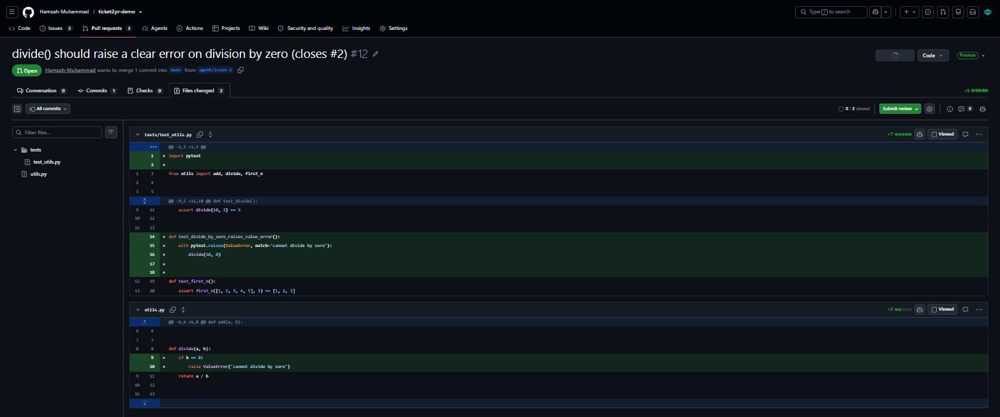
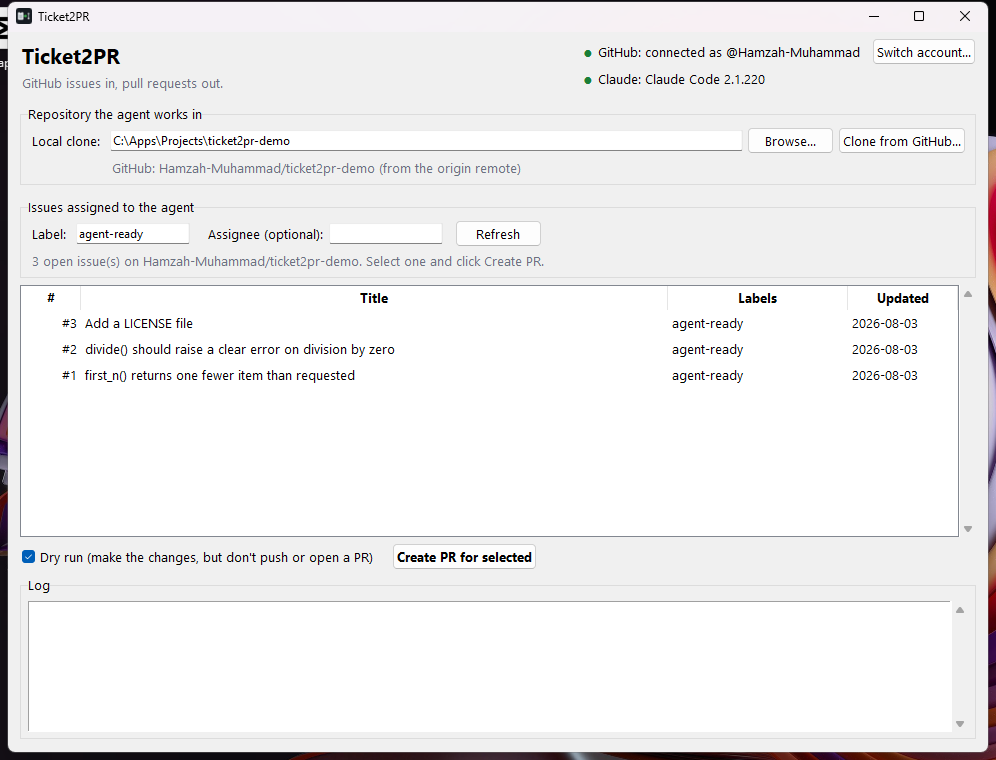

# Ticket2PR

[](https://github.com/Hamzah-Muhammad/Ticket2PR/actions/workflows/ci.yml) [](requirements.txt) [](LICENSE)

An autonomous coding agent, built on the [Claude Agent SDK](https://docs.claude.com/en/api/agent-sdk/overview), that reads GitHub issues assigned to it and opens real pull requests to resolve them.



*[PR #12](https://github.com/Hamzah-Muhammad/ticket2pr-demo/pull/12) on the demo repo - opened by the agent, not by hand. It read issue #2, branched as `agent/issue-2`, wrote the guard clause in `utils.py`, **and added a test covering it**, then linked the issue so merging closes it.*

Assign it an issue on a repo it's watching; it checks out a branch, lets Claude implement and test the fix inside a sandboxed working tree, and, if the change is real, commits, pushes, and opens a PR for a human to review. It never merges anything itself.

**Stack:** a Python app that orchestrates two things it doesn't reimplement itself - GitHub (issues, branches, PRs, all via the `gh` CLI) and Claude (the actual coding, via Anthropic's Claude Agent SDK). Python's job is entirely the plumbing around those two: which issue to pick up, when to branch, when a change is real enough to commit, when to open the PR. Claude never touches git or GitHub directly; see [The safety boundary](#the-safety-boundary) for how that is enforced.

## What this project demonstrates

This repo exists to show how I build agents and coding tools. A working agent is a model plus four things the harness gives it, and each one here is a deliberate, tested decision:

| Pillar | What it means in Ticket2PR | Where |
|---|---|---|
| **Tools** | The agent gets exactly six of the SDK's built-in tools (`Read`, `Write`, `Edit`, `Glob`, `Grep`, `Bash`) and nothing else. Two `PreToolUse` hooks narrow them further: a Bash guardrail that denies every `git`/`gh` invocation plus `rm -rf`, `sudo`, and pipe-to-shell, and a path jail that denies any `Write`/`Edit` outside the target repo or inside `.git/`. The whole git lifecycle (branch, commit, push, PR) is deterministic Python, never a model-issued command. | `agent/guardrails.py`, `agent/runner.py` |
| **System prompt** | One paragraph. It sets the job (smallest correct change), the scope (only relevant files), the verification rule (run the test suite), the one hard rule (never git/gh; the hooks enforce it anyway), and what the final message must be (a PR-ready summary). The issue title and body are the user prompt, verbatim: no template, no rewriting. | `SYSTEM_PROMPT` in `agent/runner.py` |
| **Context window** | One fresh `query()` per issue, so no issue's context bleeds into the next. `max_turns=30` caps a stuck agent. The agent's text output is captured turn by turn and its closing summary becomes the PR description, so what it reasoned is not thrown away when the context ends. | `agent/runner.py` |
| **Memory** | Deliberately none inside the model. State lives where humans can audit it: git (one `agent/issue-N` branch per issue, always recreated from a freshly pulled base) and GitHub (a label is the queue, a PR is the output). That makes every run idempotent: a dirty working tree is refused up front, an open PR is reused instead of duplicated, pushes are `--force-with-lease`. | `agent/runner.py`, `main.py`, `tasks/` |

The interesting engineering is the boundary around the model, not the call to it. The rest of this README is the operator's view of that boundary.

## Setup

Four prerequisites, all checked at startup with the fix printed if one is missing:

| You need | How to get it | How to verify |
|---|---|---|
| Python 3.11+ | [python.org](https://www.python.org/downloads/) | `python --version` |
| GitHub CLI, logged in | [cli.github.com](https://cli.github.com/), then `gh auth login` | `gh auth status` |
| Claude Code, logged in | [Claude Code](https://code.claude.com/docs/en/agent-sdk/overview), installed **natively** (`irm https://claude.ai/install.ps1 \| iex`); the SDK rides that login. An `ANTHROPIC_API_KEY` in `.env` works for API billing | `claude --version` |
| A local clone of the repo to work on | `gh repo clone owner/repo`, with push access to `origin` | `git -C path/to/clone status` |

Then:

```
git clone https://github.com/Hamzah-Muhammad/Ticket2PR.git
cd Ticket2PR
python -m venv venv
venv\Scripts\python -m pip install -r requirements.txt
```

There is no GitHub token or API key to paste anywhere, on purpose: GitHub access is whatever `gh auth login` gave you, Claude access is whatever Claude Code has. To try it on the demo repo, clone it as a sibling folder (that is the default in `config.py`):

```
cd ..
gh repo clone Hamzah-Muhammad/ticket2pr-demo
cd Ticket2PR
```

## Desktop app (Ticket2PR.exe)



`Ticket2PR.exe` at the repo root (also on the Releases page) is the same agent with a window around it, for anyone who would rather not use a terminal:

1. **Double-click.** It checks GitHub and Claude Code and shows both at the top right.
2. **Connect to GitHub** if it isn't already: the dialog asks `gh` for a one-time code, copies it to your clipboard and opens `github.com/login/device`; approve there and the app notices. Pasting a token works too. Nothing is stored by the app: the login is `gh`'s own.
3. **Pick the repo**: Browse to a local clone, or *Clone from GitHub* (it lists your repositories). The GitHub repo is read from the clone's `origin`.
4. **Pick issues.** The queue lists open issues carrying the label (`agent-ready` by default; an optional assignee filter narrows it). Select one or more and click *Create PR for selected*, or double-click an issue. Dry run is on by default: untick it to push and open real PRs.
5. **Watch the log.** The agent's work streams in; a finished PR appears as a link. A dirty working tree (from a previous dry run) is caught before the run starts, with a one-click reset.

It needs `gh` (or connect from inside the app) and a **native** Claude Code install, logged in. The Agent SDK refuses the npm install's `claude.cmd` shim for injection-safety reasons, so if that is all it finds, the app says so and shows the install command. The exe deliberately does not bundle the 253 MB Claude CLI. Settings (last repo, label, assignee, dry run) persist in `%APPDATA%\Ticket2PR\settings.json`.

Two headless modes exist to verify a build: `Ticket2PR.exe --smoke` prints what the window would show, and `Ticket2PR.exe --run-issue 2 --dry-run --target-repo C:\path\to\clone` runs one issue exactly as a click would.

## Running it

```
# Recommended first run: see the diff, nothing pushed
run.bat --dry-run

# Run for real: every open "agent-ready" issue on the config.py repo becomes a PR
run.bat --discard-changes

# Everything below also works with venv\Scripts\python main.py instead of run.bat
run.bat --target-repo C:\path\to\other\repo --dry-run
run.bat --issue 3
run.bat --label ready-for-agent
```

`run.bat` is a one-liner around `venv\Scripts\python main.py` that pauses at the end so a double-click stays readable. Prefer the window? See [Desktop app](#desktop-app-ticket2prexe).

| Flag | Meaning |
|---|---|
| `--dry-run` | Make the code changes but stop before commit/push/PR |
| `--discard-changes` | Throw away uncommitted changes in the target repo first (what a dry run leaves behind) |
| `--target-repo` | Path to a local clone with `origin` pointing at GitHub and push access (default: `config.py`) |
| `--issue N` | Only process issue `N`, instead of every open labeled issue |
| `--label` | Which issue label counts as the task queue (default: `config.py`) |
| `--repo-slug` | Override the `owner/repo` used for `gh` calls (defaults to the target repo's `origin` remote) |

A dry run leaves its changes uncommitted in the target repo so you can inspect them. The next run refuses to start on top of them; pass `--discard-changes` to reset, or commit/stash them yourself.

## Configuration

| Setting | Where it lives |
|---|---|
| Default target repo, label, model | **`config.py`**: `DEFAULT_TARGET_REPO`, `DEFAULT_LABEL`, `AGENT_MODEL` |
| GitHub auth | `gh auth login` / `gh auth status`; nothing stored in this repo |
| Claude auth | Your Claude Code login, automatically; or `ANTHROPIC_API_KEY` in `.env` (see `.env.example`, `.env` is gitignored) |

Every `config.py` default can be overridden per run with a flag.

## How it works

```
GitHub Issues assigned to the agent (agent-ready label)
        |
        v
tasks/github_source.py  ->  reads issues via `gh issue list`
        |
        v
agent/runner.py  ->  for each issue:
   1. git checkout -B agent/issue-N  (fresh branch off a freshly pulled main)
   2. one Claude Agent SDK turn, working directory locked to your repo
      - can Read/Write/Edit files, run Bash (tests, linters, etc.)
      - cannot run git or gh at all - blocked by a hook (agent/guardrails.py)
   3. if real changes exist: commit -> push -> gh pr create
      (or reuse the PR that is already open for that branch)
        |
        v
   A real PR, for you to review and merge yourself
```

The agent never merges anything or touches `main` directly; every result is a PR sitting there for human review.

## Feeding it tasks

Tasks are GitHub issues assigned to the agent. There is no bot account to hold a literal GitHub "Assignee", so a label (`agent-ready` by default) plays that role instead: it is how you hand the agent an issue and mark it ready to pick up. To give it work on any repo:

1. Open an issue describing the change, as specifically as you'd write it for a junior engineer, e.g. "`divide()` should raise `ValueError` on division by zero, add a test for it."
2. Assign it to the agent by adding the `agent-ready` label (`gh issue create --label agent-ready ...`, or add the label in the GitHub UI).

That's it: no special format required, the issue title + body become the agent's prompt directly.

## The safety boundary

This is a demo of how to give an LLM agent real write access to a codebase *safely*. The interesting engineering isn't "call the model", it's the boundary around it:

- **The agent never touches git or GitHub.** Its tool surface is `Read`, `Write`, `Edit`, `Glob`, `Grep`, `Bash`, and a `PreToolUse` hook (`agent/guardrails.py`) blocks every `git` and `gh` invocation the model might attempt through Bash. Branch creation, commit, push, and PR creation are deterministic Python in `agent/runner.py`, not model output. Agents are good at fuzzy judgment (what code to write); plain code is better at repeatable, auditable steps (the git lifecycle).
- **Write/Edit are path-jailed to the target repo.** `cwd` on `ClaudeAgentOptions` is only the working-directory *convention* the model reasons from; it does not restrict where `Write`/`Edit` can write. A second `PreToolUse` hook (`make_path_jail_hook` in `agent/guardrails.py`) resolves every `Write`/`Edit` target path and denies anything that lands outside the repo, or inside `.git/` directly (which would otherwise be a clean bypass of the git guardrail above). This isn't hypothetical; see the Demo section below.
- **Every change lands as a PR, never a commit to `main`.** A human reviews before anything merges.
- **Every run starts clean.** A dirty working tree is refused at startup (`--discard-changes` to reset), each branch is recreated from a freshly pulled base, and an already-open PR is reused rather than duplicated.
- **The task source is pluggable.** `tasks/base.py` defines a `TaskSource` protocol; `tasks/github_source.py` is the one shipped implementation. The same interface could back a `JiraSource` or `LinearSource` without touching the orchestrator.
- **Turns are capped** (`max_turns=30`) and **dry-run is the recommended first run**.

## Known limitations

Being upfront about what this does *not* protect against:

- **The Bash guardrail is a text blocklist, not real sandboxing.** It pattern-matches the command string for `git`, `gh`, and a few other dangerous patterns. A differently-phrased command that reaches equivalent behavior without those literal words (e.g. a Python git library) would not be caught by it. The Claude Agent SDK does support real OS-level command sandboxing (`ClaudeAgentOptions.sandbox`), but it's explicitly macOS/Linux-only, not available on the Windows machine this was built and demoed on.
- **Issue bodies are untrusted input fed straight into the prompt**, and nothing here restricts the agent's outbound network access (only piping-into-shell is blocked, not general `curl`/`wget`/etc. calls). On a repo where the public can open issues, a malicious issue body is a real prompt-injection surface. This project assumes trusted issue authors; don't point it at a repo where anyone can file issues without review.
- Both guardrails **fail closed** (deny on anything unexpected) but are still two specific hooks, not a formal proof of containment. Treat them as raising the bar, not as a guarantee.

## Troubleshooting

Every message below is printed by Ticket2PR itself; this table is the same information in one place.

| Message | Cause | Fix |
|---|---|---|
| `GitHub CLI (gh) is not installed or not on PATH` | `gh` missing | Install from [cli.github.com](https://cli.github.com/), reopen the terminal |
| `GitHub CLI is installed but not logged in` | no `gh` session | `gh auth login` |
| `... is not a git repo` | `--target-repo` / `config.py` points at nothing | Clone the target repo there, or pass `--target-repo` |
| `... has uncommitted changes` | a previous `--dry-run` | `--discard-changes`, or commit/stash them yourself |
| `Could not identify the GitHub repo behind ...` | `origin` isn't a GitHub remote | Pass `--repo-slug owner/repo` |
| `Claude Code CLI not found` | Claude Code isn't installed / on PATH | Install Claude Code and log in, or set `ANTHROPIC_API_KEY` in `.env` |
| `No changes produced - skipping commit/PR` | the agent decided nothing needed doing | Make the issue more specific, then re-run with `--issue N` |
| `PR already open for agent/issue-N, updated by the push` | you re-ran an issue whose PR is still open | Nothing: the existing PR now has the new commit |
| `FAILED: \`git -C ...\` exited 1: ...` | a git/gh step failed; the message carries its stderr | Read the stderr; the other issues in the batch still run |

## Architecture

```mermaid
flowchart LR
    A[TaskSource<br/>GitHubIssuesSource] -->|Task list| B[Orchestrator<br/>agent/runner.py]
    B -->|git checkout -B agent/issue-N| C[(sandboxed<br/>target repo)]
    B -->|one query() turn,<br/>cwd-scoped, Bash guardrail hook| D[Claude Agent SDK]
    D -->|Read / Write / Edit / Bash| C
    B -->|git diff check| C
    B -->|commit + push| E[GitHub branch]
    B -->|gh pr create| F[Pull Request]
```

## Demo

Run live against [`ticket2pr-demo`](https://github.com/Hamzah-Muhammad/ticket2pr-demo), a small seeded repo: three `agent-ready` issues, three real PRs, agent-authored end to end:

- [PR #10 - Add a LICENSE file](https://github.com/Hamzah-Muhammad/ticket2pr-demo/pull/10)
- [PR #11 - `first_n()` returns one fewer item than requested](https://github.com/Hamzah-Muhammad/ticket2pr-demo/pull/11)
- [PR #12 - `divide()` should raise a clear error on division by zero](https://github.com/Hamzah-Muhammad/ticket2pr-demo/pull/12)

Each diff touches only what its issue asked for. Notably, PR #12's agent turn noticed the *unrelated* pre-existing `test_first_n` failure (issue #11's bug, not yet merged) and correctly left it alone rather than fixing something out of scope.

**Three real bugs the live runs surfaced**, left in on purpose, since the interesting failure mode in agent tooling usually isn't the model, it's the surrounding automation's assumptions about state:

1. The first live pass produced PRs with diffs stacked on top of each other (issue B's PR contained issue A's changes too), because `agent/runner.py` created each new branch from whatever `HEAD` happened to be after the previous task, instead of from a freshly-updated `main`. Fixed by always rebasing each new branch from a freshly-pulled `main`.
2. Once that was fixed, mid-turn `HEAD` was observed drifting off the branch the harness checked out (onto an auxiliary branch during a Claude Code session): pushing by local branch name silently stranded the commit on the wrong ref instead of erroring. Fixed by pushing `git push origin HEAD:<branch>` explicitly rather than trusting whatever branch is locally checked out.
3. During the audit that added the Write/Edit path-jail hook (see [The safety boundary](#the-safety-boundary)), re-running the LICENSE issue live reproduced the exact bug that hook is designed to catch: the agent's first attempt wrote the file to the parent of the repo directory instead of inside it. The path-jail hook denied that write, the agent read the denial and self-corrected to the right path in the same turn, and the file ended up in the right place, confirmed by checking both locations on disk afterward.

A fourth, found in the display-readiness audit: the documented "dry run first, then run for real" flow could not actually work twice in a row, because the dry run's uncommitted changes were still in the working tree when the next run did `git checkout main`. Now refused at startup with `--discard-changes` as the fix, and covered by `tests/test_main.py`.

## Rebuilding Ticket2PR.exe

```
venv\Scripts\python -m pip install -r requirements-dev.txt
venv\Scripts\python -m PyInstaller Ticket2PR.spec --noconfirm
```

Onefile console build (`dist/Ticket2PR.exe`) with the icon and version resource embedded. It is a console app that hides its own console once the window is up: the Agent SDK, git and gh are child processes, and children of a hidden console stay hidden, whereas a "windowed" build would flash a console for each. The root-level `Ticket2PR.exe` is rebuilt and re-committed whenever app code changes.

## Project layout

```
config.py                 Edit this: default target repo, label, model
run.bat                    Double-click to run the CLI with config.py defaults
main.py                    CLI entrypoint: startup checks (gh, target repo), per-task failure isolation
ticket2pr_gui.py           Desktop entrypoint (what Ticket2PR.exe runs) + headless --smoke / --run-issue
gui/engine.py              Everything the window does minus the widgets: gh login flows, repos, CLI lookup
gui/app.py                 The tkinter window, connect and clone dialogs
Ticket2PR.spec, .ico       PyInstaller build; Ticket2PR.exe is the prebuilt binary
tasks/base.py              Task dataclass + TaskSource protocol
tasks/github_source.py     GitHubIssuesSource (gh CLI backed)
agent/guardrails.py        Bash allow/block logic + Write/Edit path-jail, both as PreToolUse hooks
agent/runner.py            Per-task orchestration: branch -> agent turn -> commit/push/PR (or reuse)
tests/                     pytest: guardrails, path-jail, task-source parsing, the run_task
                           harness (dry-run / no-change / push+PR / PR reuse), startup checks,
                           the desktop engine (login parsing, settings, CLI lookup, streaming)
pyproject.toml             ruff + black + pytest configuration
requirements.txt           Runtime deps; requirements-dev.txt adds pytest, ruff, black
```

## Testing

```
venv\Scripts\python -m pip install -r requirements-dev.txt
venv\Scripts\python -m pytest
venv\Scripts\python -m ruff check .
venv\Scripts\python -m black --check .
```

The same three run on every push via [GitHub Actions](.github/workflows/ci.yml), on Windows and Ubuntu, Python 3.11 and 3.13.

## License

MIT
